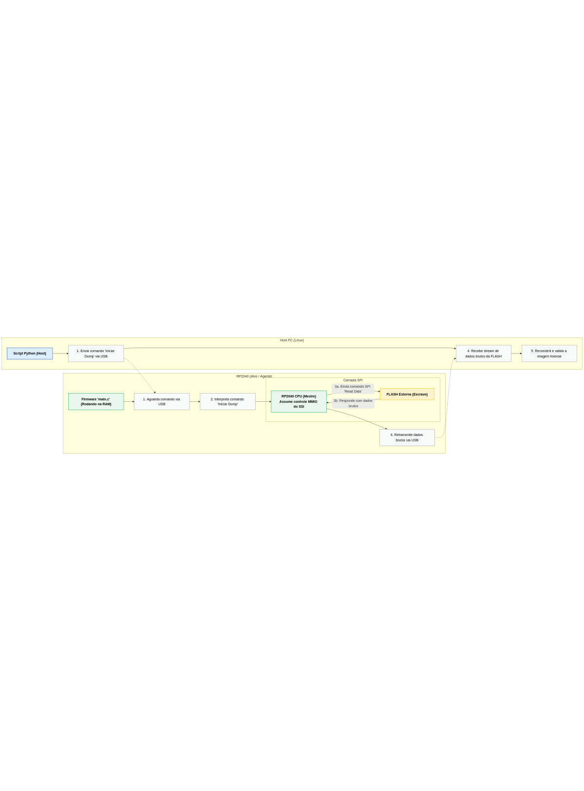

# P1: Aquisição Forense Bare-Metal de FLASH (RP2040)

[]()
[-green)]()
[](LICENSE)

Ferramenta de aquisição forense de baixo nível para a memória FLASH do RP2040, desenvolvida sem o uso de abstrações do SDK.

---

## Objetivo

Na forense de hardware, a integridade da evidência começa no "metal". Abstrações de SDK (Software Development Kit) podem ser um véu que oculta malware de firmware ou bootloaders comprometidos.

Este projeto implementa um método de aquisição forense (dump) da memória FLASH de um dispositivo RP2040 contornando o SDK. O acesso é feito através de **Controle Direto via MMIO (Memory-Mapped I/O)**, interagindo diretamente com os registradores de hardware da SSI (Interface Serial Síncrona) e UART, conforme documentado no datasheet do processador.

O objetivo é garantir um dump bit-a-bit verdadeiro, estabelecendo o primeiro elo de uma cadeia de custódia confiável.

## Metodologia: Transparência e Controle DIreto via MMIO
Nessa seção explico por que contornar o uso de SDK(Integridade e Cadeia de Custódia), falo sobre o tamanho do firmware, pegada de memoria, contorno de proteções...


## Arquitetura

1. **Firmware Alvo (`src/main.c`):** Um pequeno firmware bare-metal  que é executado no RP2040. Ele comanda manualmente a FLASH externa via SSI, lê seu conteúdo e envia o *stream* de bytes brutos pela porta UART (exposta como USB Serial).
2. **Ferramenta Host (`tools/recv_dump.py`):** Um script Python  que roda no Host Linux do investigador. Ele ouve a porta serial, recebe o *stream* de bytes e o reconstrói em um arquivo binário (a imagem do firmware).
3. **Validação (`tools/verify_dump.py`):** Ao final da aquisição, o script host calcula o hash (SHA-256) da imagem recebida para validação de integridade.

### Fluxo de operação
Esse diagrama de fluxo mostra a interação entre o microcontrolador e o Host. O P1 é um sistema de duas partes: o Firmware de Aquisição(rodando no RP2040) e o Script de Análise(rodando no Host Linux). O firmware no Pico(main.c) atuará como "Alvo" e "Agente de Extração". O fluxo de dados depende de duas hierarquias Mestre-Escravo distintas:

1. **Camada USB (Host ↔ Alvo):** Comunicação entre o Host PC e o RP2040.
2. **Camada SPI (Alvo ↔ FLASH):** Comunicação entre o processador RP2040 e seu próprio chip de FLASH externa.

O objetivo do projeto é usar a Camada USB para comandar o RP2040 a executar uma extração forense de sua própria memória, utilizando a Camada SPI.



#### Hierarquia SPI Mestre-Escravo

O núcleo deste projeto é o acesso **bare-metal** à FLASH externa.

- **Processador RP2040 (CPU):** atua como **MESTRE SPI**.  
- **Chip de FLASH Externa (W25Qxx):** atua como **ESCRAVO SPI**.

Normalmente, o SDK do Pico e o bootloader abstraem essa relação usando um modo chamado **XIP (eXecute-In-Place)**, que faz a FLASH parecer memória comum.  
Para uma aquisição forense, essa abstração não é aceitável, pois pode pular seções ou mascarar dados importantes.

Nosso fluxo de operação, portanto, ignora o XIP e implementa o protocolo Mestre-Escravo manualmente.


### Fluxo de Aquisição (Passo a Passo)

1. **Comando (Host PC):** O script Python envia um comando de `"iniciar dump"` para o RP2040 através do protocolo de dump forense.
2. **Recepção (RP2040):** O firmware `main.c`, rodando na RAM, recebe este comando.
3. **Acesso (RP2040 Mestre):** O firmware assume o controle direto do hardware SSI (controlador QSPI) do RP2040, escrevendo diretamente nos endereços de registradores mapeados em memória (MMIO).
4. **Comando (SPI):** O RP2040 (Mestre) envia comandos SPI brutos (ex.: `"Read Data" - 0x03`) para o chip de FLASH (Escravo), especificando o endereço de memória a ser lido.
5. **Resposta (SPI):** O chip de FLASH (Escravo) responde com os dados brutos pelo pino `MISO` (Master In, Slave Out).
6. **Retransmissão (RP2040):** O firmware intercepta esses dados brutos e os retransmite imediatamente para o Host PC através da Camada USB.
7. **Validação (Host PC):** O script Python recebe o fluxo de dados, reconstrói a imagem da FLASH e valida sua integridade.

---

Ao implementar diretamente o protocolo Mestre-Escravo do SPI, garantimos que o firmware está lendo a memória FLASH **byte por byte**, sem qualquer abstração, resultando em um **dump forense completo e confiável**.


## Uso (Exemplo)

```bash
# 1. Coloque o Pico em modo BOOTSEL e grave o firmware de aquisição
cp src/p1_dumper.uf2 /media/RPI-RP2

# 2. Inicie o script de recebimento no Host
python3 tools/recv_dump.py --port /dev/ttyACM0 --out firmware.bin --size 2097152

# 3. O script irá receber 2MB de dados e calcular o hash
> Recebendo 2097152 bytes de /dev/ttyACM0...
> ...
> Aquisição concluída.
> SHA256: e3b0c44298fc1c149afbf4c8996fb92427ae41e4649b934ca495991b7852b855
> Salvo em: firmware.bin                                                                                                          
```

## 📋 Entregáveis do Projeto

[ ] Código-Fonte (src/main.c): Firmware de aquisição bare-metal com acesso direto MMIO.

[ ] Ferramenta Host (tools/): Scripts Python para receber, salvar e validar o dump.

[ ] Relatório Técnico (este README): Documentação da metodologia, cadeia de custódia e artefatos de boot encontrados.

## 🔐 Licença

Este projeto está sob a Licença MIT. Veja o arquivo LICENSE para mais detalhes.
