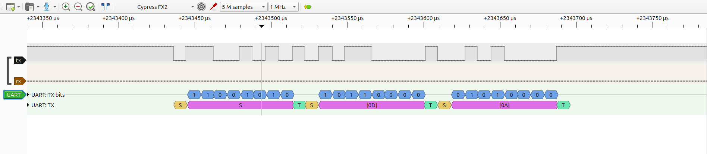
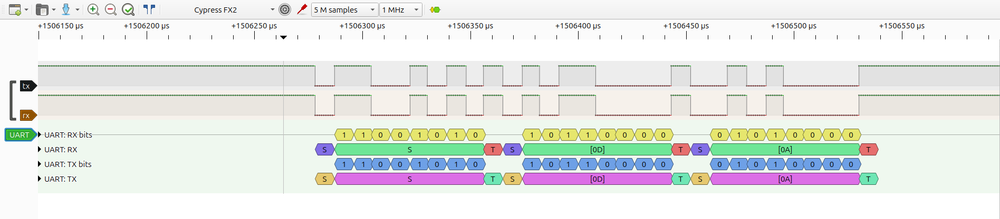

# 🔬 Research Phase — Bare-Metal RP2040 (Legacy Baseline)

> **Fase 0 do Projeto P1 — Validação Arquitetural em Baixo Nível**

Esta branch documenta a fase inicial de validação bare-metal do **RP2040**, na qual toda a stack mínima de inicialização foi construída manualmente, **sem uso do Pico SDK**.

O objetivo desta etapa foi comprovar domínio estrutural sobre:

- Cadeia de boot do RP2040 (**BootROM → boot2 → aplicação**)
- Layout de memória (FLASH/RAM, **VMA vs LMA**)
- Runtime mínimo (**crt0 manual**)
- Configuração de clocks
- Drivers via MMIO direto (**UART/GPIO**)
- Pipeline de build customizado (**linker script + ELF + BIN/UF2**)

O projeto ativo (**Sonda Forense SWD**) está na branch `main`.

---

## Estrutura do Projeto

| Diretório | Descrição |
|-----------|-----------|
| `src/` | Código C e Assembly: `start.s` (Reset Handler), `main.c` (drivers MMIO), `boot2_final.S` (acessa o boot2.bin). |
| `linker/` | `memmap.ld`: definição explícita de FLASH/RAM, símbolos do runtime e posicionamento fixo das seções. |
| `tools/` | Artefatos e scripts auxiliares: `boot2.bin`, `test_uart.py`, `uf2conv.py`, `uf2families.json`. |

---

## Objetivo Técnico da Fase 0

Esta etapa não tinha como foco “funcionar rápido”, mas sim ser **estruturalmente correta e validável**.

### Critérios de Validação Arquitetural

- `.boot2` fixo em `0x10000000`, com exatamente **256 bytes**
- `.text` iniciando exatamente em `0x10000100`
- `.data` em RAM com **LMA em FLASH (`AT > FLASH`)**
- Implementação manual do `crt0`:
  - inicialização do stack pointer
  - cópia de `.data`
  - zeragem de `.bss`
  - chamada explícita de `main`
- Geração do `firmware.bin` a partir do ELF final, validando offsets reais
- Comunicação UART funcional via MMIO direto (**sem SDK**)

---

## Funcionalidades Implementadas

### 1️⃣ Boot e Runtime Manual

- Vetor mínimo definido em Assembly
- `Reset_Handler` responsável por:
  - configurar stack
  - copiar `.data` (FLASH → RAM)
  - zerar `.bss`
  - transferir controle para `main`
- Nenhuma dependência de bibliotecas padrão

### 2️⃣ Clock Tree Manual

- Inicialização do XOSC (12 MHz)
- Seleção manual de `clk_ref` e `clk_sys`
- Escrita direta em registradores do bloco `CLOCKS`

### 3️⃣ Drivers MMIO Diretos

- Controle de GPIO via SIO
- Configuração de UART via escrita direta em registradores:
  - reset de periféricos
  - mux de pinos
  - divisores `IBRD/FBRD`
  - ativação de TX/RX

Sem HAL.  
Sem SDK.  
Sem abstrações intermediárias.

---

## 🧪 Metodologia de Teste

Os testes foram conduzidos incrementalmente:

- ✔️ Teste de inicialização (LED via GPIO)
- ✔️ Validação de layout de memória via `readelf` e `objdump`
- ✔️ Verificação de VMA/LMA e posicionamento das seções
- ✔️ Geração determinística do `boot2` com CRC32
- ✔️ Validação de UART TX via analisador lógico
- ✔️ Validação de UART RX em cenário controlado de loopback
- 🔄 Ajuste incremental de reset, mux e baud rate

> Durante esta fase, trechos do código foram isolados e comentados temporariamente para validação individual de subsistemas.

---

## 🔎 Evidências Experimentais — UART Bare-Metal

### UART TX sem loopback
A transmissão foi validada com analisador lógico e decodificação UART no PulseView, confirmando a emissão correta da sequência:

- `S`
- `CR`
- `LF`

### UART TX/RX com loopback
Com loopback físico entre TX e RX, foi possível validar a recepção da mesma sequência no pino de entrada, confirmando:

- configuração correta do periférico UART
- mux de pinos funcional
- recepção válida em cenário controlado de bancada

### O que isso valida
- TX funcional por MMIO direto
- RX funcional sob teste controlado
- integridade do caminho elétrico e da configuração de UART no baseline bare-metal

> A linha RX sem drive externo não foi tratada como cenário principal de validação nesta fase; o foco foi a comprovação funcional do subsistema em bancada.

---

## Limitações Identificadas

Embora funcional como baseline de validação, a abordagem bare-metal pura via UART apresenta limitações estruturais para o caso de uso final.

### Gargalo de Exfiltração

UART 8N1 transmite **10 bits por byte efetivo**.

Exemplo prático:

- 2 MiB = 2.097.152 bytes
- 115200 bps → 11.520 bytes/s efetivos
- Tempo aproximado: ~182 segundos (~3 minutos)

Mesmo aumentando o baud rate, o uso de linhas simples com jumpers introduz maior suscetibilidade a ruído e perda de integridade, exigindo camadas adicionais de robustez.

### Complexidade Arquitetural

O diferencial técnico do projeto principal está na implementação segura do protocolo **SWD (Safe-Read)**.

Implementar uma stack USB bare-metal completa nesta branch desviaria o foco da engenharia de baixo nível sobre o alvo e aumentaria o risco arquitetural sem ganho proporcional para a fase de baseline.

---

## Migração para Modelo Híbrido

A partir das limitações observadas, o projeto evoluiu para uma arquitetura híbrida na branch `main`:

- Pico SDK utilizado exclusivamente para transporte (**TinyUSB / USB CDC**)
- Implementação bare-metal preservada na interface SWD (**bit-banging controlado**)

Essa abordagem mantém:

- maior velocidade de exfiltração
- melhor confiabilidade de comunicação com o host
- controle total da camada crítica de SWD
- preservação do baseline bare-metal como referência estrutural

---

## Papel Atual desta Branch

Esta branch representa:

- baseline arquitetural validado
- prova de domínio do silício RP2040
- referência educacional e técnica
- fundamento estrutural do projeto principal

> A fundação sobre a qual a arquitetura híbrida da branch `main` foi construída.